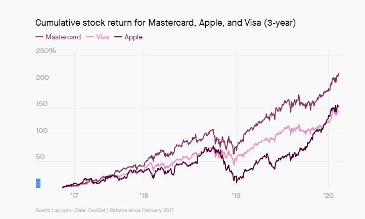

# Case-Study-Apple-Pay
## Apple Pay Case Study

---

---

In this case study, we will analyze the background, technological advantages, and outlook for Apple Pay

---

Contributors: Ted McMillan, Phara Dorisca, Sasha Flores, Khulika Rojanakanoksak and Steve Sibson

---

## Researching Apple Pay

### Company Background
Apple is an American technology company founded in April 1976 by two college dropouts Steve Jobs and Steve Wozniak. The idea was to create an user friendlier mini computer. They design electronics, computer software and online services. Their products are iPhone, iPad, Mac computer, iPod, Apple Watch They evolved to create phones, tablets, ect. 
Apple started with Apple Pay in 2014 by partnering with Visa, Master Card and American Express. They wanted to use a single-use digital token. It is mobile payment and digital wallet. 
Apple Pay Competitors: Samsung Pay, Google Pay, PayPal, Stipe, BlueSnap, PaySimple, WePay, PayMotion.

---

### Technology and Advantage
 Apple Pay lets users make purchases in stores with their smartphones, using near-field communication (NFC) technology. A tiny antennain the phone transmits encrypted credit card data without consumers having to swipe their card. Apple Pay uses a security protocol — known as the EMV standard — that other mobile wallets don't use. The credit card companies Euro-pay, MasterCard and Visa first developed this standard in the 1990's and it's widely used in Europe, as well as other parts of the world.Credit cards that use the EMV standard are equipped with microchips that store sensitive data. These so-called chip-and-PIN cards are considered more secure than the "magstripe" credit cards used in the United States because card numbers and transaction details are encrypted before being sent to a merchant's computer, or point-of-sale terminal.
In the case of Apple Pay, EMV takes the form of a process known as "tokenization," according to John Shier, a security advisor with computer security company Sophos. Once you enroll a card, [Apple] doesn't actually store the card number itself on the device or on its own servers," Shier told Live Science. "They store a digital representation, or token, which is a 16-digit code that is meant to represent your card within the 'secure element' of the iPhone itself."

---

### Strengths and Weakness
#### Strength 
1 Apple eco system enhance users' esperience in Apple Pay. You can use via Apple Watch or Iphone. 
2 Strong customer royalty in Apple brand means large size of users.
3 Secure and simple payment method.
4 Network with bank. Major credit card issuers worldwide are compatible with Apple Pay.
4 Free of charge for retailer.
#### Weakness
1 No prepaid account. Some cultures are more familiar with prepaid like in China (bid market share)
2 No buildin reward.
3 Less adoption among small retailer.

---

### Future
> *"according to research & markets.com, a recent survey shows that nearly one-third of consumers in the USA became first-time users of contactless payments during the pandemic"*

Contactless card payments in the U.S. are projected to increase eight-fold between 2020 and 2024, and mobile proximity payments are also rising rapidly. Apple Pay accounts for about 5% of global card transactions and is on pace to handle 1-in-10 such payments by 2025, according to recent trend data compiled by Bernstein, a research firm. “There are indeed plenty of reasons to worry that Apple may attempt to disrupt the payments ecosystem,” Bernstein analysts, led by Harshita Rawat, wrote in a research note.

The digital payments race is an immense opportunity, representing about $1 trillion in revenue around world. Visa and MasterCard process more than $14 trillion of payments each year and are still growing as more transactions go online, flow through apps, and as consumers in many parts of the world use cash less often.

Apple Pay makes money by taking a sliver of each transaction that runs through the device. Users can store their credit and debit cards on the wallet and use it to make contactless payments—beefed up with biometric security—through their phone’s near-field communication (NFC) tech. In the US, contactless payments are forecast to increase to $1.5 trillion in 2024, up from $178 billion this year, according to Juniper Research.